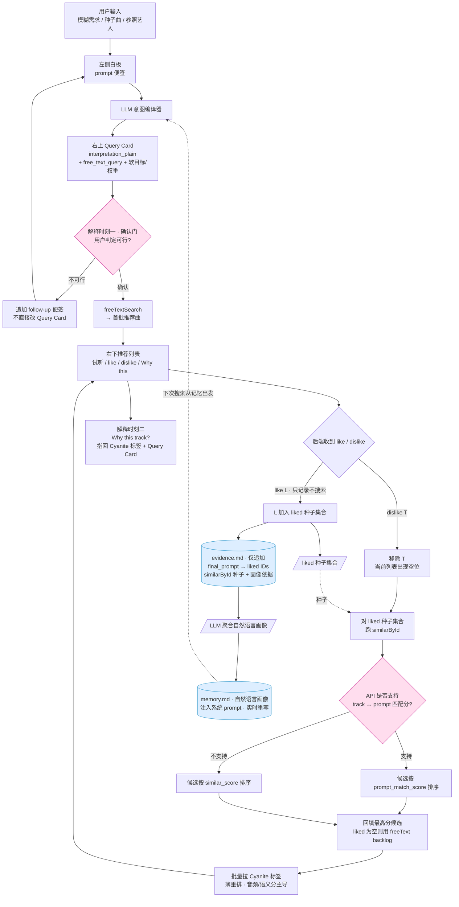

# Cochlea — 夜晚版 PRD（一晚冲刺）

> 前后端可演示 · audio-first · 白板式意图澄清 + 用户确认后检索 · 基于 Cyanite API

---

## 0. 这版和 24h 全量 PRD 的差异

| 变化点 | 旧（PRD.md） | 新（本版） |
|--------|-------------|-----------|
| **硬过滤** | tag 硬约束（纯器乐/BPM 上限） | **删除**。Query Card 只剩解释 + freeText 查询 + 软目标/权重 |
| **输入界面** | 普通输入框 / 卡片流 | **左右分栏**。左侧是白板，用户 prompt / follow-up 都以便签贴上去；右侧展示理解与推荐 |
| **Query Card** | 可改，但流程没明确停 | **加人工确认门**：出理解 → 停 → 用户判定可行；不可行就往白板追加 follow-up，系统重新编译 |
| **检索起点** | freeText ⊕ similarById 一把召回 | Query Card 确认后只跑 `freeTextSearch`，直接出首批推荐；**不提前粗扩展** |
| **相似扩展** | freeText 出 5 个种子 → 每个种子 similarById 扩成 5 个簇 | **延后到用户 dislike 时**。只有踩掉一首、列表出现空位，才对用户**已 like 的曲**跑 `similarById` 找相似曲回填 |
| **反馈机制** | 左右滑写记忆；踩一首剪枝，赞一首扩展回填 | **like 只记为声音证据（不搜索）；dislike 移除当前曲 → 用 liked 种子跑 similarById → 回填空位**。回填优先按“候选与最后确认的 Query Card 的匹配度”排序，API 不支持则退回 similar score |
| **反馈去向** | 两个消费者（种子 + 参数）混在一起 | **两份都持久化（两个 markdown，不用数据库）**：画像证据库 `evidence.md`（**最后确认的 prompt** → liked IDs，当 similarById 种子 + 画像依据） + 用户画像 `memory.md`（从证据聚合的自然语言画像，注入 prompt） |
| **持久化介质** | — | **不使用 SQLite / 任何数据库**。会话状态在内存；跨会话记忆 = 两个 markdown 文件 |
| **前端** | Tinder 卡交互 / 或不做 | **做最小可演示界面**：左白板 + 右上需求理解 + 右下推荐列表 / Why this |

---

## 1. 完整文字版 Workflow

**① 输入 → 白板便签 → 意图编译**
用户给一句模糊需求、一首种子曲、或一个参照艺人名字。这条需求不会消失，而是以一张 **post-it 便签**贴到左侧白板上。LLM 读取白板上的当前上下文，把它编译成右上角一张可见但不直接编辑的 **Query Card**，含一句大白话 `interpretation_plain`（"我把你的需求理解成这样"）。**这是第一个解释时刻。**

**② 确认门（停一下）**
系统在这里**停住**，把 Query Card 交还给用户判定：如果理解正确，用户确认；如果理解不对，用户**不是直接改卡里的字段**，而是继续往左侧白板贴一条 follow-up requirement（例如"不要太史诗，更像深夜独处"）。系统把原始 prompt + follow-up 一起重新编译，右上角的 Query Card 随之变化。**没确认不往下走。**

**③ 初始搜索**
Query Card 确认后，跑 `freeTextSearch`（把语言打进音频空间），返回首批推荐曲目。这里**只做 freeText 检索，不做 similarById 粗扩展**，避免在用户还没表达喜欢之前就把不确定方向铺开。

**④ 推荐列表 + 第二个解释时刻**
右侧下半部分展示推荐列表。每首歌可以试听、like / dislike，也可以点开 **Why this track?**。这个解释指回 Cyanite 标签、Search score、Query Card 里的目标语言，以及它和用户需求的对应关系。**这是第二个解释时刻。**

**⑤ 反馈循环：like 只记证据，dislike 才搜索相似并回填**
用户对每首歌回 like / dislike：
- **like L** → L 成为用户明确认可的声音证据。**只记录**：把 L 加进本会话的 liked 种子集合，并落进 `evidence.md`。**此时不跑任何检索**，当前列表不动。
- **dislike T** → T 从当前推荐列表移除，留下一个空位。系统**这时才**对用户**已 like 的曲（种子集合）**跑 `similarById`，把找到的相似曲当候选，挑一首**回填这个空位**。若用户还没 like 过任何曲，就用 `free_text_backlog`（首批 freeText 召回里尚未展示的）补位。

> 关键：`similarById` **只由 dislike 触发**，且种子是用户喜欢的曲——"踩掉一首 → 用你喜欢的方向补一首"。like 不触发任何搜索，避免在用户还没踩之前就铺开不确定方向。

回填排序的理想逻辑是：对这些相似候选，计算它们与**最后确认的 Query Card / freeText prompt** 的匹配程度，优先回填匹配度最高的曲子（"最后确认"指用户在确认门可能多次改过，取最终那一版白板上下文）。**需要向主办方确认 Cyanite API 是否支持“给定 track 与自然语言 prompt 的匹配分数”。**如果不支持，就把所有由 `similarById` 找到的候选放到一起，按 Cyanite 返回的 `similar_score` 排序，回填最相似的曲子。

**⑥ 薄重排**
拿到用户**喜欢的 ID** 后，批量拉取这些曲和候选池曲目的 Cyanite 标签，对候选池做**薄重排**——音频相似分 / prompt 匹配分始终是主导信号，标签软目标只做轻微调序。重排后继续等用户反馈，而不是自动无限扩展。

**⑦ 反馈的两个去向（两个 markdown 都持久化 —— 本版核心，不用数据库）**
- **画像证据库 `evidence.md`（持久化 · 原始层 · 仅追加）**：记录"用户在某条 prompt 下喜欢了哪些曲目 ID"，即 `(final_prompt, liked_track_ids[], ts)`。`final_prompt` 取**用户最后上传/确认的那一版白板上下文**——用户在确认门可能改过 prompt，记忆要锚定最终意图，而不是中途的草稿。它有双重身份——本次会话当 `similarById` 的**种子池**；跨会话累积成**用户画像的原始依据**。喜欢一首就 append 一条，**不抛弃、不改旧行**。
- **用户画像 `memory.md`（持久化 · 聚合层 · 实时重写）**：由 LLM 从 `evidence.md` **聚合**成一段自然语言画像（"你偏爱黑暗、克制的电子质感，排斥明亮抒情；多在深夜独处场景"），**注入系统 prompt**。下次编译 Query Card 时带着它。

**⑧ 闭环**
下一次搜索**从记忆出发**（系统 prompt 已带着这个用户的参数偏好去编译 Query Card），用户继续通过白板 follow-up 控制方向，推荐越来越贴近他的品味，回到 ①。

> 一句话：**用户先确认系统怎么理解需求；系统先用 freeText 给结果；用户 like 只记证据；只有 dislike 时才用 liked 种子跑 similarById 回填空位。** 解释和控制都发生在白板 + Query Card + Why this 三个可见位置上。

---

## 2. 流程图版 Workflow



---

## 3. 后端组件 + 数据契约（接口先冻死）

五个端点，四套 JSON，两个 markdown 文件（**不使用 SQLite / 数据库**）。前端只做"接缝"：左白板、右上 Query Card、右下推荐列表。

**Whiteboard Post**
```json
{
  "id": "post_01",
  "role": "initial_prompt",
  "text": "I need something for a lonely midnight train ride",
  "created_at": "2026-06-27T22:15:00Z"
}
```

**Query Card（无硬过滤，不直接编辑）**
```json
{
  "interpretation_plain": "我把'孤独的午夜列车'理解成低能量、克制、带一点忧郁和移动感的音乐",
  "free_text_query": "lonely midnight train ride restrained melancholic low energy steady motion",
  "soft_targets": [{"dim": "mood", "value": "melancholic", "weight": 0.6}],
  "negatives": [{"dim": "mood", "value": "uplifting"}]
}
```

**Recommendation Card**
```json
{
  "track_id": "track_123",
  "title": "Night Windows",
  "artist": "Example Artist",
  "audio_url": "https://...",
  "source": "free_text",
  "search_score": 0.82,
  "tags": {
    "mood": ["melancholic", "calm"],
    "instrument": ["piano", "soft percussion"],
    "energy": "low",
    "bpm": 86
  },
  "why": "它符合你确认过的 low energy / melancholic / steady motion 目标，并且 Cyanite 标签显示它有 calm mood、低能量和接近 86 BPM 的稳定律动。"
}
```

**Candidate Pool Item**
```json
{
  "track_id": "track_456",
  "source_liked_track": "track_123",
  "similar_score": 0.91,
  "prompt_match_score": null,
  "status": "candidate"
}
```

**端点**

| 端点 | 入 | 出 | 干什么 |
|------|----|----|--------|
| `POST /intent` | `{text}` | `{session_id, whiteboard_posts[], query_card}` | 首条 prompt 上白板；LLM 编译，**带记忆里的参数偏好** |
| `POST /intent/follow-up` | `{session_id, text}` | `{whiteboard_posts[], query_card}` | 追加 follow-up 便签；重新编译 Query Card；仍停在确认门 |
| `POST /intent/confirm` | `{session_id}` | `{cards[]}` | 过确认门 → 只跑 freeTextSearch → 首批推荐 |
| `POST /feedback` | `{session_id, track_id, verdict}` | `{cards[], candidate_pool_size}` | like 只记 liked 种子 + 落 evidence；dislike 移除 → 对 liked 种子跑 similarById → 回填 + 薄重排 |
| `GET /your-sound` | `{session_id}` | 记忆摘要 | 可选，演"越用越准" |

**会话状态（内存 dict，会话结束就扔，不落盘）**
```
session: id, user_id,
         whiteboard_posts[]  // initial prompt + follow-up requirements
         query_card,
         visible_cards[]      // 当前右下推荐列表
         free_text_backlog[]  // freeTextSearch 尚未展示的候选（liked 为空时的回填来源）
         liked_tracks[]       // 用户 like 的曲 = dislike 时 similarById 的种子集合
         candidate_pool[]     // dislike 时对 liked 种子跑 similarById 的结果（现算，可缓存复用）
         disliked_tracks{}    // 用户明确不喜欢的曲子

candidate_pool item:
  track_id, source_liked_track, similar_score, prompt_match_score?, tags?, status

跨会话记忆 = 两个 markdown 文件（无数据库）:
  memory/<user_id>.evidence.md  // 仅追加: 每行 (final_prompt, liked_track_ids[], ts)
                                //   final_prompt = 用户最后确认/上传的那版白板上下文
  memory/<user_id>.memory.md    // LLM 从 evidence 聚合的自然语言画像，注入 prompt
```

**反馈 / 回填逻辑（核心，留一个 assert 自检即可）**
- like L → 把 L 加进 `liked_tracks`；append 一条进 `evidence.md`（`final_prompt` 下的 liked 列表）；触发 `memory.md` 重写。**不跑任何检索，`visible_cards` 不动。**
- dislike T → 从 `visible_cards` 删除 T 形成空位 → **此时**对 `liked_tracks` 跑 `similarById`（单种子或多种子）得到候选灌入 `candidate_pool` → 选 1 首回填。
  - 若 `liked_tracks` 为空（用户还没 like 过）→ 用 `free_text_backlog` 的下一首补位。
- 回填排序（候选池非空时）：
  - 理想：`prompt_match_score(candidate, query_card.free_text_query)` 降序，其中 `query_card` 是**最后确认**的那一版（initial prompt + 全部 follow-up steering 编译出）。
  - 如果 Cyanite API 不支持单曲与 prompt 的匹配分：`similar_score` 降序。
- 薄重排：`score = w_primary * primary_match + w_soft * tag_match - w_neg * neg_match`，其中 `primary_match` 优先是 `prompt_match_score`，否则是 `similar_score` / `search_score`；护栏 `w_primary > w_soft + w_neg`（**无硬过滤，负向只扣分不剔除**）。

---

## 4. 一晚时间块（约 7h + 1h buffer）

| 块 | 时间 | 干什么 | 立住的标志 |
|----|------|--------|-----------|
| **B0** | 0:00–0:30 | 冻 4 个 JSON 契约 + 两个 markdown 文件格式；Cyanite 凭证连通 | freeText / similarById 各打通一发 |
| **B1** | 0:30–2:00 | `/intent` + `/intent/follow-up`：白板便签 + Query Card + **确认门** | 一句话 → 卡；贴 follow-up → 卡变 |
| **B2** | 2:00–3:30 | `/intent/confirm`：freeText 出首批推荐；不做粗扩展 | 确认后右下出现可试听推荐列表 |
| **B3** | 3:30–5:30 | `/feedback`：like 只记 liked 种子；dislike 后用 liked 种子 similarById 回填空位 | 赞一首→记进 liked；踩一首→用你喜欢的方向补上空位 |
| **B4** | 5:30–7:00 | 两层 markdown 记忆：`evidence.md` 追加 + `memory.md` 重写 + 闭环 | 新会话读 memory.md，Query Card 已带"你的声音" |
| **Buf** | 7:00–8:00 | demo 脚本 + 写死输入 + 全程走缓存 | 现场不连真 API 也能跑 |

**落后从下往上砍**：闭环持久化 → 薄重排 → 候选池 prompt_match 排序。
**永不砍**：白板 follow-up 确认门 + dislike 后才用 liked 种子扩展回填 这条主循环（这是和"Excel 检索"的本质区别）。

---

## 5. 验收 / Demo

1. **确认门成立**：输入一句话 → 左侧出现 prompt 便签 → 右上看到 Query Card → 说"理解错了" → 左侧追加 follow-up 便签 → Query Card 和后续结果都变。
2. **不提前粗扩展**：确认后先只出现 freeText 推荐；系统不会在用户反馈前把相似簇铺开。
3. **like 只记录、不搜索**：赞一首电子 → 它进入 liked 种子集合、`evidence.md` 多一行；当前推荐列表**不变**，后端此刻不发任何检索。
4. **dislike 才触发相似搜索 + 回填**：踩掉一首 → 它从右下列表消失；系统**这时才**对用户已 like 的曲跑 `similarById`，按 prompt 匹配度（或 fallback similar score）补进一首。（用户还没 like 过 → 用 freeText backlog 补位。）
5. **两层记忆都落盘（markdown，无 DB）**：喜欢一首 → `evidence.md` 多一条 `(final_prompt, liked_id)`，`final_prompt` 是用户**最后确认**的那版需求；这份证据既当 dislike 时的 similarById 种子，又被 LLM 聚合进 `memory.md`，**新开会话**时 Query Card 自带"你的声音"。
6. **可解释**（沿用全量 PRD）：Query Card 解释用户需求；Why this track 解释单曲推荐；每条通俗理由都指回 Cyanite 真实标签，幻觉率 ≈ 0。

---

## 6. 待确认问题

1. **Cyanite API 是否支持单曲与自然语言 prompt 的匹配分？**
   - 支持：dislike 回填时，候选池按 `prompt_match_score` 排序。
   - 不支持：候选池按 `similarById` 返回的 `similar_score` 排序。

---

## 7. 范围外

复杂前端动效、Tinder 卡 UI、直接编辑 Query Card 字段、用户反馈前的相似簇粗扩展、协同过滤与热度、模型训练微调、多租户与计费、概念级对话微调、形状 sparkline。
